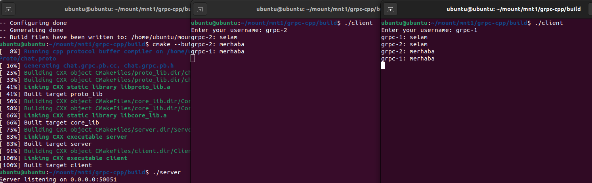

# gRPC C++ Chat Application

Bu bir mesajlaşma uygulamasıdr. **gRPC kullanılarak C++** ile geliştirilmiştir.

Client ve Server ayrı executable olarak çalışır.  
Server’a bağlanan tüm client’lar, gönderilen mesajları **real-time** olarak alır.

---

## Kullanılan Teknolojiler

- **C++17**
- **gRPC**
- **CMake**
- **vcpkg** (dependency management)

---

## Gereksinimler

- Linux (Ubuntu önerilir)
- CMake ≥ 3.15
- GCC / Clang (C++17 destekli)
- vcpkg
- gRPC ve Protobuf (vcpkg üzerinden)

---

## Kurulum

### vcpkg ile bağımlılıkları kur

```bash
git clone https://github.com/microsoft/vcpkg.git
cd vcpkg
./bootstrap-vcpkg.sh

./vcpkg install grpc protobuf
```
### Projeyi ekle

```bash
git clone <repo-url>
cd grpc-chat-application-cpp
mkdir build
cd build

cmake .. -DCMAKE_TOOLCHAIN_FILE=~/vcpkg/scripts/buildsystems/vcpkg.cmake
cmake --build .
```
### Projeyi çalıştır

```bash
./server // Önce server
./client // Client 1
./client // Client 2
/quit // Çıkış
```
---

<p align="center">
  
</p>  

---

